# Purpose {#purpose}
The purpose of `svgtools` is to manipulate SVG files that are templates of charts the user wants to produce. In vector graphics one copes with x-/y-coordinates of elements (e.g. lines, rectangles, text). Their scale is often dependent on the program that is used to produce the graphics. In applied statistics one usually has numeric values on a fixed scale (e.g. percentage values between 0 and 100) to show in a chart. Basically, `svgtools` transforms the statistical values into coordinates and widths/heights of the vector graphics.

SVG file format is nothing else than XML (see [here](https://www.w3schools.com/graphics/svg_intro.asp)). By the means of package `xml2`, `svgtools` reads SVG files and then changes certain attributes or even whole elements in the XML document.

For example, an SVG image might look like this:

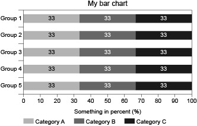

Its file content contains lines in XML:
```
...
<g id="myBars">
	<g>
		<rect x="141.732" y="92.126" fill="#C6C6C6" width="94.394" height="14.173"/>
		<rect x="236.126" y="92.126" fill="#878787" width="94.394" height="14.173"/>
		<rect x="330.52" y="92.126" fill="#3C3C3B" width="94.677" height="14.173"/>
		<text transform="matrix(1 0 0 1 183.396 101.8799)" font-family="'ArialMT'" font-size="10">33</text>
		<text transform="matrix(1 0 0 1 277.7612 101.8799)" fill="#FFFFFF" font-family="'ArialMT'" font-size="10">33</text>
		<text transform="matrix(1 0 0 1 372.1265 101.8799)" fill="#FFFFFF" font-family="'ArialMT'" font-size="10">33</text>
	</g>
	...
</g>
<rect id="myFrame" x="141.732" y="85.04" fill="none" stroke="#000000" stroke-width="0.5" stroke-miterlimit="10" width="283.464" height="141.732"/>
...
```
What we see here are three rectangle elements (top bar of the chart) with graphical x-coordinates and widths that lie within a rather arbitrary range. The same holds for three text elements (value labels of top bar) and their coordinates that are stored within a SVG transformation matrix in attribute 'transform'. Their text entry is fixed to 33. All of these are grouped together (top bar with value labels) and then grouped again (all the bars). The last line shown corresponds to the rectangle that serves as the outer frame of the data area of the chart.

The following lines of code are enough to set coordinats, widths and numbers in the bar chart right when, for example, percentage values are stored within a dataframe of 5 rows (the groups) and 3 columns (the categories):
```
svg <- read_svg(file = "images/fig1.svg")
myValues <- data.frame(cat1=c(0.1,0.2,0.3,0.4,0.5),
                       cat2=c(0.35,0.25,0.35,0.25,0.35),
                       cat3=c(0.55,0.55,0.35,0.35,0.15))
svg <- stackedBar(svg = svg,frame_name = "myFrame",group_name = "myBars",
                  scale_real = c(0,100),values = myValues*100)
write_svg(svg = svg,file = "images/fig1_values.svg")
```
The result looks like this:

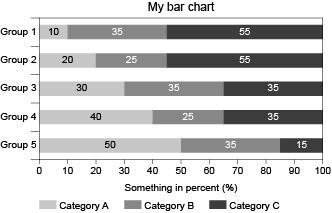

The magic happens at the function call for `stackedBar`. Here, one argument refers to the named rectangle 'myFrame' to define outer limits for the graphical coordinates and one argument to the named group of elements 'myBars' containing rectangles (bar segments) and texts (value labels) for the chart. Concerning the values one wants to show in the chart, the "real" scale is defined by a vector ranging from 0 to 100 and a dataframe with values is provided. `svgtools` can now calculate the corresponding graphical coordinates and widths and change the elements in 'myBars' accordingly.

This vignette explains how to set up SVG files so that `svgtools` can work with them and gives insight in the most common usage of package functions. For detailed information on all functions and arguments see `?stackedBar` and others.

# Reading, displaying and writing SVG files {#filehandling}
Functions for file handling and display are rather straight-forward in `svgtools`. A typical workflow looks like that:
```
svg <- read_svg(file = "myFile.svg")
summary_svg(svg = svg)
display_svg(svg = svg)
# Code to manipulate the SVG
# ...
display_svg(svg = svg)
write_svg(svg = svg,file = "myFile_out.svg")
```
`read_svg` relies on `read_xml` from the `xml2` package. So it has all the possibilities to read a file from the file system, a connection or even a raw vector. It defaults to encoding UTF-8, which may be changed with argument `enc="latin-1"`, for example.

Function `summary_svg` is a convenience function that prints some useful information about the SVG content on the console (or whereever `sink` is set to). For the SVG in Fig. 1 the output would look like this:
```
[1] "************************"
[1] "** -- SVG SUMMARY: -- **"
[1] "************************"
[1] "-- NAMED GROUPS:"
[1] "myBars with 5 children"
[1] "-- AVAILABLE FRAMES:"
[1] "myFrame"
[1] "-- USED FONTS:"
[1] "'ArialMT'"
[1] "-- USED FONT SIZES:"
[1] "10"
[1] "-- USED COLORS:"
[1] "#C6C6C6" "#878787" "#3C3C3B" "none"    "#000000"
```
One can see that there is a named group ('myBars') in the SVG. It contains five child elements, that are the five bars of the chart, see further below. Also, there is one "available frame" (a named rectangle) called 'myFrame'. This information helps with setting right the arguments in the function calls to manipulate the SVG. Further information on used fonts, font sizes and colors in the SVG only serves the purpose of validating the consistency of the design. One can invoke `summary_svg` directly by argument `summary=TRUE` of `read_svg`.

To display an SVG on the current viewport one may use `display_svg`. Standard viewport depends on operating system and IDE. For example, RStudio plots the image under the Viewer tab. By default, width and height of the bitmap (image) are derived from its content and the current DPI setting of the viewport. But one can set desired width and height with the correspondent function arguments.

Typically, `display_svg` is used before and after SVG manipulation to get visual proof of the changes. Therefore, argument `display=TRUE` of `read_svg` conveniently invokes the function.

Finally, `write_svg` uses `write_xml` from the `xml2` package to write the (then manipulated) SVG to file system or an open connection. By default, hidden elements of the SVG are removed in the written file (not in the XML document in the R environment). To change this behavior set `remove_hidden=FALSE`. If one wants to remove all groupings in the written file (again, not in the XML document itself) it is possible to set `flatten=TRUE`. This may be beneficial in further layouting tasks on the resulting SVG image.

# General principles of operation {#general}
`svgtools` relies heavily on naming objects of the SVG. One can always accomplish that with any text editor by inserting id-attributes in the XML element for the object. See the following:
```
<rect id="myFrame" x="141.732" y="85.04" width="283.464" height="141.732"/>
```
Naming an object in that way is also possible in almost any vector graphics program. (Check the manuals.) For example, in Adobe Illustrator using the Layers Panel to name objects ultimately leads to XML elements with id-tags when saving as SVG.

The following rules apply:

* Elements (frame, groups) have to be named without spaces or any irregular characters (like _-,;!?).
* There must not be duplicate names. Adobe Illustrator actively prevents that by adding numbers to a name that would be a duplicate otherwise. Be mindful of that behavior and check `summary_svg`!
* Only specific elements need to be named. Further naming does not hinder execution as long as it doesn't violate the rule right above. Still, knowing which elements need to have names keeps the SVG tidy, so the following sections provide insight on that.

On the side of the values one wants to show in a chart, be mindful that `svgtools` does not calculate anything apart from the right coordinates and widths/heights of objects. This is relevant in situations like the following:

* If one wants to get a bar chart that stacks up to 100 percent, the vector(s) of numerical values should sum up to 1 (with scale 0-1) or 100 (with scale 0-100). Providing, in contrast, absolute frequencies (in combination with the scales mentioned) would lead to unexpected behavior like overfloating bars.
* If one wants value labels to show percentages as integer numbers, one needs to provide them in the numeric range of 0-100 or multiply relative frequencies accordingly when setting the `values` argument at function calls.
* As an exception, function `percentileBar` takes percentile values and recalculates them into differences between percentiles to provide widths for bar segments.

Adjustment of charts with lines and/or symbols needs a simple vector of numerical values. For bar charts, it is possible to adjust several bars at once. In that case, one needs to provide a dataframe or a matrix (with only numerical values). Then, rows always concern different bars, while columns define the sequence of bar segments to stack.

Horizontal and vertical alignment of charts works essentially the same. A corresponding argument is provided in all manipulating functions except `changeText`. Mind that `alignment="horizontal"` means adjusting x-coordinates for all chart types while `alignment="vertical"` always refers to adjustment of y-coordinates. This may be counter-intuitive when it comes to line charts, see below.

# Adjusting bar charts

## General bar charts
For a general bar chart one needs to prepare an SVG file that has named (XML attribute 'id') groups (XML element 'g') of bar segments (XML element 'rect') and, optionally, value labels (XML element 'text').
```
svg <- read_svg(file = "images/fig3.svg",summary = TRUE,display = TRUE)
```
Reading the SVG file with arguments `summary=TRUE` and `display=TRUE` conveniently prints information about it on the console and displays the SVG in the current viewport (see [here](#filehandling)). It might look like that:

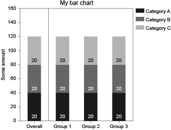

In this example the XML structure has two named groups. The first consists of the XML elements (3 rectangles and 3 texts) for the leftmost bar and is named 'overall'. The second one is a group named 'subgroups' that itself contains three groups of XML elements for the three bars to the right. See the following excerpt of the file:
```
...
<g id="overall">
	<rect x="156.746" y="255.119" fill="#3C3C3B" width="26.667" height="56.693"/>
	<rect x="156.746" y="198.425" fill="#878787" width="26.667" height="56.693"/>
	<rect x="156.746" y="141.732" fill="#C6C6C6" width="26.667" height="56.693"/>
	<text transform="matrix(1 0 0 1 164.5171 306.2188)" fill="#FFFFFF" font-family="'ArialMT'" font-size="10">20</text>
	<text transform="matrix(1 0 0 1 164.5171 249.5259)" fill="#FFFFFF" font-family="'ArialMT'" font-size="10">20</text>
	<text transform="matrix(1 0 0 1 164.5171 192.833)" font-family="'ArialMT'" font-size="10">20</text>
</g>
```

```
<g id="subgroups">
	<g>
		<rect x="213.438" y="255.119" fill="#3C3C3B" width="26.667" height="56.693"/>
		<rect x="213.438" y="198.425" fill="#878787" width="26.667" height="56.693"/>
		<rect x="213.438" y="141.732" fill="#C6C6C6" width="26.667" height="56.693"/>
		<text transform="matrix(1 0 0 1 221.21 306.2188)" fill="#FFFFFF" font-family="'ArialMT'" font-size="10">20</text>
		<text transform="matrix(1 0 0 1 221.21 249.5259)" fill="#FFFFFF" font-family="'ArialMT'" font-size="10">20</text>
		<text transform="matrix(1 0 0 1 221.21 192.833)" font-family="'ArialMT'" font-size="10">20</text>
	</g>
	<g>
		...
	</g>
	<g>
		...
	</g>
</g>
...
```
The summary on the console will reflect this. Note that the number of child elements depends on wether a named group consists of bar elements or of further (sub)groups:
```
[1] "-- NAMED GROUPS:"
[1] "overall with 6 children"
[1] "subgroups with 3 children"
```
Note: It is not allowed to nest the grouping any further!

The bar chart in the example of figure 3 needs two separate function calls to be adjusted to values on the statistical scale. The first call to `stackedBar` refers to the group named 'overall', the second one to the group named 'subgroups'. It is necessary to have a named frame (XML element 'rect') for both cases (see [here](#purpose)). Since the bar chart will be adjusted in vertical direction (`alignment="vertical"` makes sure that y-coordinates and heights are changed) the SVG needs to have only one such rectangle for both the overall bar and the bars for subgroups.

The main difference between the two function calls is how one provides the values. In the case that a group refers to only one bar (here: 'overall') values are provided as a simple numerical vector. If a matrix or a dataframe were provided, only the first row would be used. The function call will fail with an error message if the number of values does not match the number of bar segments (or value labels).

In the case that a group refers to (sub)groups (here: 'subgroups') one needs to provide a matrix or a dataframe. Rows will be used to get values for each bar, while the order of columns defines the values from left to right with `alignment="horizontal"` or bottom to top with `alignment="vertical`. The function call will stop with an error message if the number of rows does not match the number of bars and also if the number of values does not match the number of bar segments (or value labels).
```
svg <- stackedBar(svg = svg,frame_name = "frame",group_name = "overall",
                  scale_real = c(0,160),values = c(9.97,42.42,105.71),
                  alignment = "vertical",has_labels = TRUE,label_position = "end",
                  decimals = 0,display_limits = 10)
df.subgroups <- matrix(1:9*8,nrow=3)
svg <- stackedBar(svg = svg,frame_name = "frame",group_name = "subgroups",
                  scale_real = c(0,160),values = df.subgroups,
                  alignment = "vertical",display_limits = 10)
display_svg(svg = svg)
write_svg(svg = svg,file = "images/fig3_values.svg",
          remove_hidden = FALSE,flatten = TRUE)
```
The program code above will ultimately display the following chart and also save it to a file:

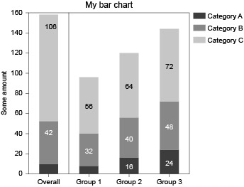

The first function call to `stackedBar` in the example above has set every argument there is for this function. `has_labels=TRUE` and `decimals=0` are actually default values, which is why things work the same in the second function call. While the meaning of `has_labels=TRUE` is obvious, note how values are rounded to the number of decimal digits desired, so that '105.71' becomes '106' in the chart. It is possible to set the rounding of the labels to rounding away from zero by `options("svgtools.roundAwayFromZero" = TRUE)` such that ‘106.5’ becomes ‘107’ (default: ‘106’).

`label_position="end"` puts value labels to the top of the bar segments in vertical aligment and to the right side (or left side for negative values) in horizontal alignment. The default setting used in the second function call puts value labels in the center of the bar segments. Argument `display_limits` is used to suppress value labes in a range around zero. If only one number is provided it refers to the absolute value. In the example the value '8' of the category A in group 1 is not shown any more because it is lower than 10. Note that this is evaluated for the exact value, not the rounded one. So '10.1' would be visible (as '10' with `decimals=0`) while '9.9' would not.

Note that display options for value labels are rather limited in the current version of `svgtools`. It is neither possible to set the distance from the edge of bar segments with `label_position="start"` or `label_position="end"` nor will `stackedBar` change any coordinates or alignment of texts that do not concern the x-axis with `alignment="horizontal"` or y-axis with `alignment="vertical"`. This is why in the example '106' (category C of overall bar) leans to the right: the text element was not aligned to be centered in the SVG template (set XML attribute 'text-anchor' to "middle" beforehand, in order to do this).

The example code calls `write_svg` with otional arguments (see [here](#filehandling)). With `remove_hidden=FALSE` one will still have text elements for the two value labels that are not displayed in the saved SVG file. And `flatten=TRUE` leads to an SVG file without any groups (XML elements 'g'). All 60 graphical elements are stored directly beneath the XML document node.

## Special bar charts
With the help of hidden bar segments and recalculated `values` one could already produce a wide range of bar charts using `stackedBar`. For convenience, `svgtools` offers three special variants. They work the same as the general case when it comes to naming SVG elements. The following sections describe each one very briefly and focussing on their distinct usage of function arguments.

### Reference bar
In `svgtools` a reference bar is a stacked bar chart that is aligned around a nullvalue. Bar segments up to a so-called reference category (a certain column/position of `values`) are positioned to the left (with `alignment="horizontal"`) or to the bottom (with `alignment="vertical"`) while further segments lie to the right or top.

The following figure shows a possible template. Note that it is not necessary to adjust bar segments and values (in horizontal direction) beforehand.

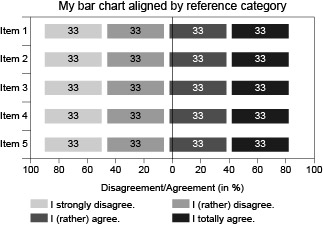

An example code for usage of `referenceBar` looks like that:
```
values <- matrix(c(1,2,3,4,2,3,4,1,3,4,1,2,4,1,2,3,1,2,3,4)*10,
                 nrow = 5,byrow = TRUE)
svg <- referenceBar(svg = svg,frame_name = "frame",group_name = "group",
                    scale_real = c(-100,100),values = values,
                    reference = 2,nullvalue = 0)
```
In regard of the x-axis labels, `scale_real` has to provide an interval with a range of 200 that includes the `nullvalue`. So even though the percentages in the example are of course positive, defining the range of values from -100 to 100 is feasible. The `nullvalue` will most often be at zero, so this is also set as the default value. `reference=2` defines, that the first two values in each bar will be represented to the left of whereever the nullvalue lies, while further values (another two in the example) will be shown to the right. The result looks like this:

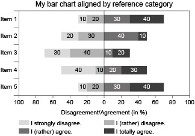


### Difference bar
Another specialized bar chart provides the ability to show difference values in regard to a null value (usually zero). Bar segments, and optionally value labels, of values lower than the null value are positioned to the left (with `alignment="horizontal"`) or to the bottom (with `alignment="vertical"`) while higher values are represented to the right or to the top.

The following example makes use of the general behavior of `svgtools` that elements related to NA values are simply hidden from the chart:

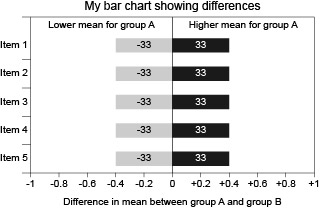

Note that in the example bar segments and value labels exist for the possibility of both a negative or a positive value to be shown. Grouping and naming works the same as for the general `stackedBar`. It would be possible to prepare just one bar segment and value label. In that case, one would have to know the values beforehand if different coloring like in the example is desired.
```
df <- data.frame(diff_negative=c(NA,NA,-0.7,NA,-0.33),
                 diff_positive=c(0.4,0.55,NA,0.02,NA))
svg <- diffBar(svg = svg,frame_name = "frame",group_name = "group",
               scale_real = c(-1,1),values = df,nullvalue = 0,
               label_position = "end",decimals = 1,display_limits = 0.1)
```
The sample code prepares a dataframe with two vectors: one with negative, the other with positive values. Of course, both are of the length of bars to adjust, so any numerical vector element is matched by NA in the other vector.

The call to `diffBar` holds no surprises. The special argument `nullvalue` is set to zero (the default value), meaning the negative values will lie to the left, while positive values will lie to the right from whereever "statistical" zero has its x-coordinate in the graph.

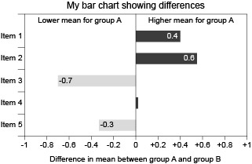

Note that number formatting depends on the systems locale (country-specific settings).

### Percentile bar
Bar charts representing percentiles are a rather special case: First, the x-coordinates (with `alignment="horizontal"`) or y-coordinates (with `alignment="vertical"`) where bars start depend on the (scaled) value of the lowest percentile. Second, width of bar segments is given by the (scaled) difference between two percentile values. Together, this means that there must be one bar segment less than percentile values.

Take for example the common case where one wants to show the .05, 0.25, 0.50 (median), 0.75 and 0.95 percentile of a metric distribution. This could be shown by four bar segments (0.05-0.25, 0.25-0.50, 0.50-0.75, 0.75-0.90). However, if the median should appear as as thicker line and not just as the edge between two bar segments, one could provide another bar segment and values for median plus-and-minus some epsilon. The following example illustrates this setting:

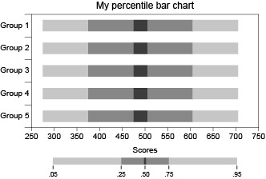

Values preparation in the code includes subtracting some epsilon (1.5 in the example) from the median values (="lower bound") and then providing an "upper bound" by adding two times epsilon to those values.
```
set.seed(12345)
yy <- -2:2*15
percentiles <- data.frame(p5=rnorm(5,350,10)+yy,
                          p25=rnorm(5,450,10)+yy,
                          p50low=rnorm(5,510,10)+yy-1.5,
                          p75=rnorm(5,560,10)+yy,
                          p95=rnorm(5,640,10)+yy)
percentiles$p50upp <- percentiles$p50low+3
svg <- percentileBar(svg = svg,frame_name = "frame",group_name = "group",
                     scale_real = c(250,750),values = percentiles)
```
Note that the column order in `values` may not reflect the order of percentiles. Values are ordered automatically when adjusting each bar. Note also that epsilon is interpreted in the "statistical" scale. To get a specified width for the bar segment of the median (e.g. exactly 1mm) one needs to calculate the transformation into graphical values beforehand.

`percentileBar` has no special arguments and value labels are not permitted. The result looks like that in the example:

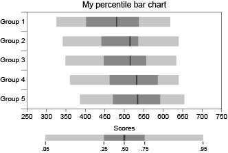

# Adjusting line and/or symbol charts {#linesSymbols}
Function `linesSymbols` provides the ability to adjust a chart with lines and/or symbols to values on the "statistical" scale. Symbol types currently supported are:

* Rectangles: XML elements of type 'rect'
* Circles/ellipses: XML elements of type 'circle'
* Polygons: XML elements of type 'polygon'
* Linegroups (to show symbols like 'X' or '+'): XML elements of type 'g' (a group), containing XML elements of type 'line' only


A common example would be the progression of some measure (e.g. a percentage) over time, perhaps for several groups:

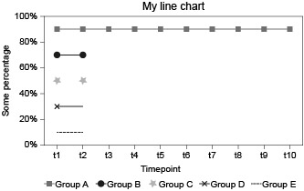

Adjusting a chart with lines and/or symbols by the means of `linesSymbols` follows the same [general principles of operation](#general) that adjusting bar charts (`stackedBar` and its variants) does. One major difference is, that with lines and/or symbols charts every (zigzag) line and/or set of (uniform) symbols needs to be grouped together (XML element 'g') and such a group needs to be named directly (setting XML attribute 'id'). It is not possible to group those any further.

So, for every group A to E in the example, there exists a named group element in the XML structure. The elements contained in that group differ rather strongly in regard of their type and amount. The example was chosen to show different symbol types that `svgtools` can handle as well as several possibilities to compile a template.

Group A: In the example, group A shows a line with rectangles as "dot marks" for 10 timepoints. Therefore, the group element with name 'gA' consists of 9 XML elements of type 'line' (which is, of course, one less than the number of values) and 10 XML elements of type 'rect'. Note that in the process of adjusting, only one coordinate (here: y-coordinate) will be changed, so the positioning on the other coordinate (here: x-coordinate) in the template matters. If the visible symbol order differs from the order of the corresponding XML elements in the template file, XML elements are still adjusted according to the visible symbol order. Because it is rather tedious to provide 9 lines and 10 rectangles with exact intervals on the x-axis beforehand, the examples for group B to E show alternative ways to achieve this.
```
<g id="gA">
	<rect x="153.07" y="96.378" fill="#706F6F" width="5.67" height="5.669"/>
	<line fill="none" stroke="#706F6F" stroke-miterlimit="10" x1="155.905" y1="99.212" x2="184.252" y2="99.212"/>
	<rect x="181.417" y="96.378" fill="#706F6F" width="5.67" height="5.669"/>
	<line fill="none" stroke="#706F6F" stroke-miterlimit="10" x1="184.252" y1="99.212" x2="212.598" y2="99.212"/>
	...
</g>
```

Group B: For group B the "dot mark" is a circle that is of course an XML element 'circle' in the SVG file. Note that it is sufficient to provide only two circles and one line. `linesSymbols` automatically duplicates those elements to the right amount and positions them at the x-axis with fixed intervals calculated from distances of the elements provided. Lines are expected to be tangent to each other at their ends (leading to a zigzag line), so this approach would not work if one wants to leave gaps between line segments.
```
<g id="gB">
	<circle fill="#1D1D1B" cx="155.905" cy="127.559" r="3.543"/>
	<circle fill="#1D1D1B" cx="184.251" cy="127.559" r="3.543"/>
	<line fill="none" stroke="#1D1D1B" stroke-miterlimit="10" x1="155.905" y1="127.559" x2="184.252" y2="127.559"/>
</g>
```

Group C: Another possibility for symbols are any polygons (like triangles, hexagons or stars) that are represented as XML elements of type 'polygon' in the SVG file. `linesSymbols` reads all of their coordinates (XML attribute 'points') and calculates adjusted x- or y-coordinates by their centroid (that is the midpoint of the smallest rectangle surrounding all points). In the example, only two symbols are provided (which will be duplicated like for group B) and there is no line.
```
<g id="gC">
	<polygon fill="#B2B2B2" points="160.157,157.704 157.154,157.688 155.439,160.158 154.526,157.291 151.653,156.419 
		154.091,154.664 154.03,151.654 156.45,153.436 159.286,152.448 158.344,155.305 	"/>
	<polygon fill="#B2B2B2" points="188.503,157.704 185.5,157.688 183.785,160.158 182.872,157.291 179.999,156.419 182.437,154.664 
		182.376,151.654 184.796,153.436 187.632,152.448 186.69,155.305 	"/>
</g>
```

Group D: For group D, only one symbol and one line segment is provided. The fixed interval on the x-axis for duplicated symbols is simply calculated from the line element. The symbol itself is a so-called "linegroup". It is an XML element 'g' (a group) of line segments (those being XML elements 'line', obviously). Like with polygons, only x- or y-positions are adjusted. Calculations for the scaled coordinated take the centroid of all lines into account.
```
<g id="gD">
	<g>
		<line fill="none" stroke="#000000" stroke-miterlimit="10" x1="153.4" y1="181.747" x2="158.41" y2="186.757"/>
		<line fill="none" stroke="#000000" stroke-miterlimit="10" x1="153.4" y1="186.757" x2="158.41" y2="181.747"/>
	</g>
	<line fill="none" stroke="#1D1D1B" stroke-miterlimit="10" x1="155.905" y1="184.252" x2="184.252" y2="184.252"/>
</g>
```

Finally, group E shows the simplest case with only one line (and no symbol provided). The line will be duplicated in the way that is described for group B. Formatting options of the line element are preserved so that it still appears "dotted" in the final result.
```
<g id="gE">
	<line fill="none" stroke="#1D1D1B" stroke-miterlimit="10" stroke-dasharray="3.0416,1.0139" x1="155.905" y1="212.599" x2="184.252" y2="212.599"/>
</g>
```

Note: In the example, y-coordinates of SVG elements need to be adjusted to scaled values. Therefore, it is `alignment="vertical"` even though resulting lines will flow from left to right. This is also the default for `linesSymbols` while `alignment="horizontal"` is default for `stackedBar` and its variants. In lines and/or symbols charts adjustment with `alignment="horizontal"` would change x-coordinates of elements from the top (lower y-coordinates) to the bottom (higher y-coordinates), while `alignment="vertical"` for `stackedBar` stacks bar segments from bottom to top. Those definitions have been made with most common applications in mind.

The following example code contains five calls to `linesSymbols`. One for each of the names groups in the SVG file. Arguments change very little. Of course, `symbolType` has to be set to the right kind of symbol element for each group. And for group C, `has_lines=FALSE` is set to prevent an error because at least one line element is expected as default. In contrast to `stackedBar`, `linesSymbols` expects `values` to be a vector of numerical values.
```
set.seed(12345)
values <- matrix(c(rnorm(10,0.95,0.03),rnorm(10,0.75,0.05),
                   rnorm(10,0.55,0.07),rnorm(10,0.35,0.05),
                   rnorm(10,0.15,0.03)),nrow = 5,byrow = TRUE)
values[2,8] <- as.numeric(NA)
svg <- linesSymbols(svg = svg,frame_name = "frame",group_name = "gA",
                    scale_real = c(0,1),values = values[1,],
                    symbol_type = "rect")
svg <- linesSymbols(svg = svg,frame_name = "frame",group_name = "gB",
                    scale_real = c(0,1),values = values[2,],
                    symbol_type = "circle")
svg <- linesSymbols(svg = svg,frame_name = "frame",group_name = "gC",
                    scale_real = c(0,1),values = values[3,],
                    has_lines = FALSE,symbol_type = "polygon")
svg <- linesSymbols(svg = svg,frame_name = "frame",group_name = "gD",
                    scale_real = c(0,1),values = values[4,],
                    symbol_type = "linegroup")
svg <- linesSymbols(svg = svg,frame_name = "frame",group_name = "gE",
                    scale_real = c(0,1),values = values[5,],
                    symbol_type = NULL)
```
Note that for group B, one element of the values vector is set to NA. `linesSymbols` handles this well by hiding the corresponding graphical elements (sets 'display="none"' as XML attribute). All other functions in `svgtools` follow the same behaviour.

For groups B to E warnings are displayed on the console, saying that not enough elements were provided in the template and that they will be automatically duplicated. Those warnings are not to be worried about, one should just check if the result looks as expected.

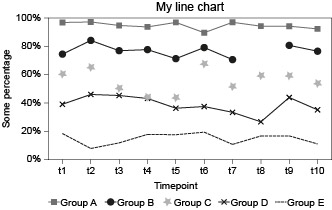

In the result, all `values` are shown in the chart at their rightful position. Line for group B is broken at the point where NA was given as value. Even though this is seldom necessary, the handling of the XML structure allows for subsequent calls to `linesSymbols` for the same named groups. Hidden elements, like the two line segments and one circle for group B would reappear.

# Adjusting scatter plots
Adjusting scatter plots is a special case of a symbols chart that could also be done with two calls to `linesSymbols` of opposite `alignment` and with intelligent ordering of `values`. For convenience, the wrapper function `scatterSymbols` provides this ability within one function and without the need to think alot.

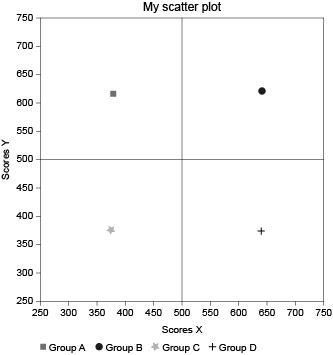

The example consists of the four possible types of symbols described [here](#linesSymbols). Note that each one has to be within a named group. The actual number of elements within this group does not matter. `scatterSymbols` will either a) work with the symbols provided if their amount matches the length of `values` or b) it will duplicate the first element of the group until the right amount is reached or c) it will remove elements from the bottom of the group until the right amount remains. This behaviour makes subsequent calls to `scatterSymbols` for the same group possible, but it means that under normal circumstances there should be a group for every symbol of different shape or colour.
```
<g id="gA">
	<rect x="211.944" y="157.973" fill="#706F6F" width="5.669" height="5.669"/>
</g>
<g id="gB">
	<circle fill="#1D1D1B" cx="363.445" cy="158.14" r="3.543"/>
</g>
<g id="gC">
	<polygon fill="#B2B2B2" points="216.486,299.075 213.483,299.059 211.768,301.529 210.855,298.662 207.982,297.791 210.42,296.035 
		210.359,293.025 212.779,294.807 215.615,293.819 214.672,296.676 	"/>
</g>
<g id="gD">
	<g>
		<line fill="none" stroke="#000000" stroke-miterlimit="10" x1="362.603" y1="294.648" x2="362.603" y2="301.734"/>
		<line fill="none" stroke="#000000" stroke-miterlimit="10" x1="359.06" y1="298.191" x2="366.146" y2="298.191"/>
	</g>
</g>
```
The arguments of `scatterSymbols` are straightforward. Instead of one scale, two scales for x- (`scale_real_x`) and y-axis (`scale_real_y`) need to be declared. `values` is expected to be a two-dimensional object (matrix or dataframe) with at least two columns. The first column is interpreted as x-values, the second as y-values.
```
set.seed(12345)
df <- data.frame(g=rep(1:4,10),x=rnorm(40,500,75),y=rnorm(40,500,75))
df[df$g==1,]$x <- df[df$g==1,]$x-35
df[df$g==2,]$y <- df[df$g==2,]$y-35
df[df$g==3,]$x <- df[df$g==3,]$x+35
df[df$g==4,]$y <- df[df$g==4,]$y+35
svg <- scatterSymbols(svg = svg,frame_name = "frame",group_name = "gA",
                      scale_real_x = c(250,750),scale_real_y = c(250,750),
                      values = df[df$g==1,2:3],symbol_type = "rect")
svg <- scatterSymbols(svg = svg,frame_name = "frame",group_name = "gB",
                      scale_real_x = c(250,750),scale_real_y = c(250,750),
                      values = df[df$g==2,2:3],symbol_type = "circle")
svg <- scatterSymbols(svg = svg,frame_name = "frame",group_name = "gC",
                      scale_real_x = c(250,750),scale_real_y = c(250,750),
                      values = df[df$g==3,2:3],symbol_type = "polygon")
svg <- scatterSymbols(svg = svg,frame_name = "frame",group_name = "gD",
                      scale_real_x = c(250,750),scale_real_y = c(250,750),
                      values = df[df$g==4,2:3],symbol_type = "linegroup")
```

The result looks like this:

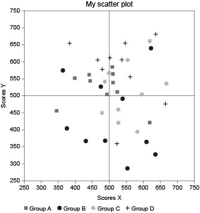

# Changing text in text elements
Use `changeText` to change the displayed text of a text element. In contrast to other functions, the text element may not be within a group, but has to be either named itself (set XML attribute 'id') or contain the text from argument `element_name` to identify it.

One thing to be aware of is that SVG (version 1.1) is rather limited when it comes to formatting and positioning text. One may change aligment by setting optional argument `alignment`, but expect some rather odd behaviour depending on the programme used to create the SVG template.
